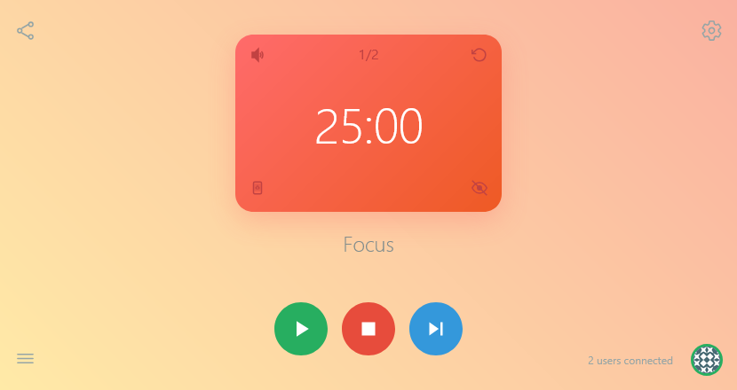

# AroWā

A lightweight, permissionless, real-time collaborative focus and break timer for teams, allowing multiple users to synchronize work and break intervals across devices. Inspired by the [Pomodoro Technique®](https://en.wikipedia.org/wiki/Pomodoro_Technique), AroWā allows users to customize and extend intervals for complete flexibility and personalization.

<sup>The Pomodoro Technique® is a registered trademark by Francesco Cirillo. AroWā is not affiliated with, associated with, or endorsed by the Pomodoro Technique® or Francesco Cirillo.</sub>



## Features

- **Real-time Collaboration**: Multiple users can join and manage the same timer session
- **URL Based Sharing**: Create unique URLs to share sessions with other users
- **Custom Intervals**: Define unlimited timer intervals with custom durations and descriptions
- **Audio Alerts**: Customizable alert sounds for interval transitions
- **Custom Styling**: Apply custom CSS to each interval for personalized visual cues
- **Local Persistence**: Session data is stored in the browser's local storage
- **Responsive Design**: Works seamlessly on desktop and mobile devices

## Usage

> [!WARNING]
> Only share the unique session URL with trusted users. Anyone connected to the same session can control the timer, add or edit intervals, and manage settings.

### Creating a Session

1. Open the application URL in your browser
2. A new session will be automatically created with a unique URL
3. Share the session URL with other users to collaborate
4. Save or bookmark the session URL for future access

### Joining a Session

1. Open a shared session URL in your browser
2. The app will automatically join the existing session
3. Timer and intervals will sync automatically

## API Endpoints

### Session Info

```
GET /api/session/:sessionId
```

Returns information about a session.

## Quick Start

### Prerequisites

- Node.js 22.0.0 or higher
- npm or yarn package manager
- Docker (optional)

### Clone the Repository

```bash
git clone https://github.com/kapdap/arowa
cd arowa
```

### Installation

Install the required dependencies using npm and start the server.

```bash
npm install
npm run build
npm start
```

### Using Docker

Alternatively, you can run AroWā in a Docker container. Ensure Docker compose is installed and configured.

```bash
docker compose up -d
```

The production server will be available at http://localhost:3000.

## Development

### Running Locally

To run the application locally for development, use the following commands:

```bash
npm install
npm run dev
```

This will start the development server at http://localhost:3000.

See [CONTRIBUTING](CONTRIBUTING.md) for more details on setting up the development environment and contributing to the project.

## License

This project is licensed under the [GPL-3.0 license](LICENSE). See `LICENSE` for details.
